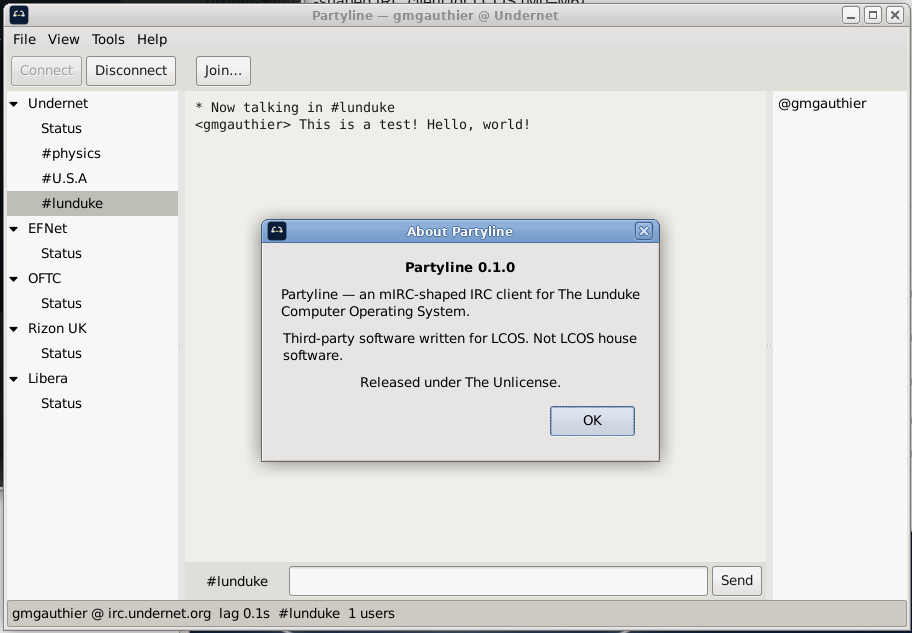

# Partyline

**Vended by Grok Build**



An **mIRC-shaped IRC client** for The Lunduke Computer Operating System (LCOS). The window is mIRC 5.x / 6, not HexChat.

Binary: `partyline`. Unlicense.

LCOS itself: [https://github.com/BryanLunduke/LCOS](https://github.com/BryanLunduke/LCOS)

## Status

**M6 / v0.1.0.** `.deb`, tarball, AppImage. See [INSTALL.md](INSTALL.md).

First run (no `~/.config/partyline/partyline.ini`) loads the shipped server list (Undernet, EFNet, OFTC, Rizon UK, Libera). Nick comes from the local username.

| Doc | What |
|---|---|
| [INSTALL.md](INSTALL.md) | `.deb`, tarball, AppImage, git build |
| [DEVELOPMENT.md](DEVELOPMENT.md) | Locked decisions, architecture, milestones M0–M6 |

## Build

```
sudo apt install build-essential meson ninja-build pkg-config g++ libgtkmm-3.0-dev
meson setup build
meson compile -C build
./build/partyline
```

## License

[The Unlicense](https://unlicense.org). See [UNLICENSE](UNLICENSE).
